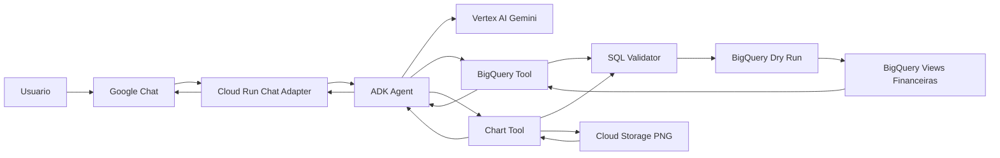

# Arquitetura Tecnica

## Imagem Da Arquitetura

Artefatos visuais:

- `docs/architecture_flow.svg`: diagrama visual para documentacao e apresentacao.
- `docs/architecture_flow.mmd`: fonte Mermaid editavel.

## Visao Geral

## Status Atual

O fluxo principal foi validado em 2026-05-04 com mensagem real no Google Chat.

Estado da POC:

- Cloud Run `finance-ai-chat-adapter` publicado em `us-central1`;
- endpoint `/health` validado sem token;
- endpoint `/google-chat` validado por `curl` e pelo Google Chat;
- modo Workspace Add-on desativado no app do Chat;
- invocacao publica do Cloud Run liberada para a POC;
- datas relativas validadas;
- multiplas perguntas na mesma mensagem validadas;
- graficos financeiros simples e comparativos validados;
- Cloud Storage usado para publicar PNGs dos graficos.

## Componentes

### Google Chat

Canal de conversa para usuarios de negocio. Na POC, ele envia eventos HTTP para o Cloud Run.

### Cloud Run Chat Adapter

Servico HTTP responsavel por:

- receber eventos do Google Chat;
- extrair usuario, espaco, thread e texto;
- chamar o agente ADK;
- devolver a resposta para o Chat.

### ADK Agent

Agente principal da POC. Por enquanto, ele tambem atua como agente financeiro.

Responsabilidades:

- entender perguntas financeiras;
- escolher a view correta;
- gerar SQL BigQuery Standard SQL;
- chamar a tool segura;
- chamar a tool de graficos quando o usuario pedir visualizacao;
- explicar o resultado em portugues.

### BigQuery Tool

Camada controlada de execucao SQL.

Responsabilidades:

- permitir apenas `SELECT` e `WITH`;
- bloquear DDL, DML e comandos administrativos;
- permitir somente views cadastradas no catalogo;
- executar dry run;
- bloquear consultas acima do limite de bytes;
- serializar datas e valores numericos para JSON.
- retornar erro estruturado quando o BigQuery rejeitar a SQL.

### Chart Tool

Camada de BI conversacional da POC.

Responsabilidades:

- receber SQL segura, titulo, eixo X e metricas;
- reutilizar a BigQuery Tool para consultar dados;
- gerar grafico PNG com `matplotlib`;
- suportar grafico de linha e barras;
- suportar multiplas series, como realizado versus orcado;
- aplicar legenda amigavel e eixo em reais;
- salvar PNG no Cloud Storage;
- retornar URL do grafico para o Google Chat.

### Cloud Storage

Armazena os PNGs gerados pela Chart Tool.

Na POC, os links sao usados diretamente no Google Chat. Para producao, revisar acesso publico, URLs assinadas, retencao e limpeza dos arquivos.

### BigQuery

Fonte oficial da POC.

Camada criada:

- tabelas ficticias;
- views semanticas;
- queries de validacao.

## Decisao Sobre Banco Vetorial

Nao usamos banco vetorial na fase 1 porque as perguntas da POC sao sobre dados estruturados.

Banco vetorial/RAG entra na fase 2 se quisermos responder perguntas sobre:

- politicas financeiras;
- definicoes de KPI;
- manuais;
- dicionarios de dados;
- documentos internos.

## Memoria

Na POC local e no adapter, a memoria de conversa usa `InMemorySessionService`.

Para producao, considerar:

- Agent Engine Sessions para historico de conversa;
- tabela BigQuery para auditoria;
- Memory Bank apenas quando houver governanca para memoria de longo prazo.

## Proxima Arquitetura

Para um piloto governado, a arquitetura deve evoluir para:

- service account dedicada no Cloud Run;
- auditoria persistente em BigQuery;
- validacao forte do emissor Google Chat;
- estrategia segura para acesso aos graficos;
- opcionalmente, Vertex AI Agent Engine como runtime separado do adapter.
